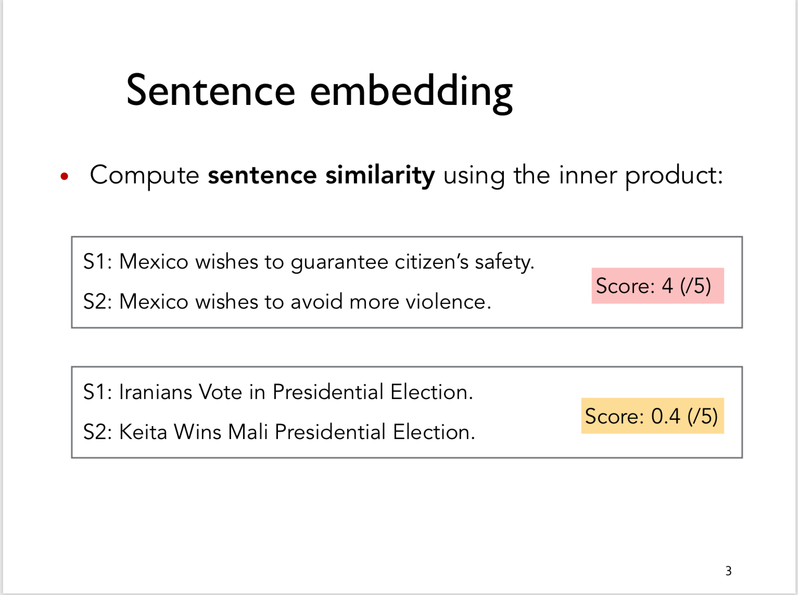
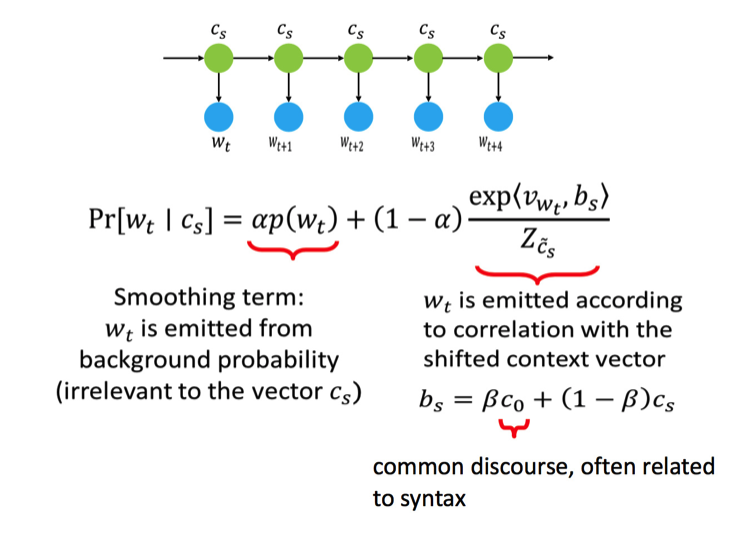

# [CS224 Paper]A Simple but Tough-to-beat Baseline for Sentence Embeddings

## 简介
@Sanjeev Arora, Yingyu Liang, Tengyu Ma
@Princeton University
@ICLR 2017
## 简单介绍
在 CS224 的第二节课中我们学了 word2vec 算法。该算法的的目的是找出一种对文字更合适的表示方法。但是实际生活中我们更关心的是一个句子的意思。这篇文章就是找出一种合适的句子的向量表示。
## Why Sentence Embedding
首先，如果我们能拿到句子的向量表示的话，我们就能用向量内积的方式来计算句子的相似度。

除此之外，如果我们能用向量表示句子的话，就可以用它作为一个句子的特征来进行分类来完成一些任务，如情感分析(sentiment analysis)等。

## 已有的做法
1. Simple additional composition of the word vectors
	
2. Use sophisticated architectures such as convolutional neural networks and recurrent neural networks
	
## 论文的灵感来源
这种训练一个Averaging model 的思路来源于Wieting et al., 2016[^1]，之后通过经验观察得到，当人们用内积来表示两个句子的相关性的时候引入了很多没有实际含义的方向（direction），于是产生了第二步的降纬度处理。
> These anomalies cause the average of word vectors to have huge components along semantically meaningless directions.
> —— In the Page2

## 本论文的新方法
论文中的方法非常的简单，一共只有两步。核心就是加权词带法加上去除一部分特殊方向。
> weighted Bag-of-words + remove some special direction
1. 使用一种加权的词带法
	
	其中 $p(w)$ 为某个单词的频率，这一步中引入了一个特殊的权值，这个权值会让高频词的权值下降。求和后得到暂时的句向量。
2. 计算语料库中所有句向量构成的矩阵的第一个主成分 u，让每个句向量减去它在 u 上的投影（类似 [PCA](ulysses://x-callback-url/open?id=vd5I-ajbi0rXntk7yrCz4g)）。其中，一个向量 v 在另一个向量 u 上的投影定义如下：
	$$
	Proj_u v = \frac{uu^T v}{||u||^2}  
	$$
	*注：本段原文完全来自大佬的博客*

## A Probabilistic Interpretation

我们是这样假设的，一个单词的出现分为两种情况，一种是和某个中心词相关，而另一种则是和中心词无关的。浴室可以写出以下的公式。

其中公式 2中第一部分，代表着和中心次无关的出现的情况，而第二项则是代表着和中心词有关的情况，其中 $\beta$代表着该单词出现是和中心词相关是因为语法 (syntax) 相关的情况。
*注：式子中的 $\alpha$ 和 $\beta$ 是超参。 *
## Results

## 参考
1. 大佬的文章（[链接地址](http://www.hankcs.com/nlp/cs224n-sentence-embeddings.html)）
2. [Paper]A Simple but Tough-to-beat Baseline for Sentence Embeddings

[^1]:	John Wieting, Mohit Bansal, Kevin Gimpel, and Karen Livescu. Towards universal paraphrastic sentence embeddings. In International Conference on Learning Representations, 2016.